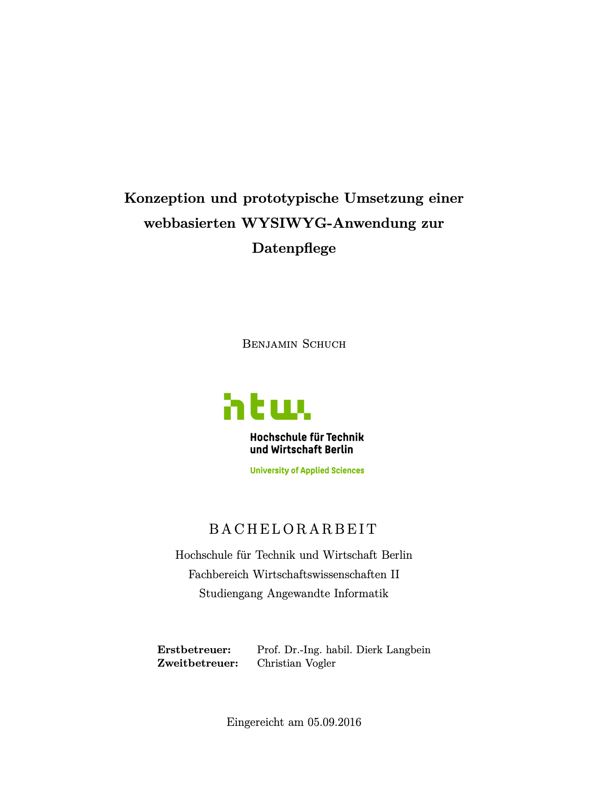

# Bachelorarbeit: Konzeption und prototypische Umsetzung einer webbasierten WYSIWYG-Anwendung zur Datenpflege

[](thesis.pdf)

## 📋 Informationen

| | |
|---|---|
| **Hochschule** | Hochschule für Technik und Wirtschaft Berlin |
| **Fachbereich** | Wirtschaftswissenschaften II |
| **Studiengang** | Angewandte Informatik |
| **Autor** | Benjamin Schuch |
| **Jahr** | 2016 |

## 📖 Über die Arbeit

Die netbase GmbH entwickelte für Yokogawa Deutschland die FlowConfigurator-Software, mit der Vertriebsmitarbeiter anhand von Kundenspezifikationen passende Druck- und Durchflussmessgeräte aus dem Produktbestand auswählen und konfigurieren können. Die Software nutzt ein vielschichtiges, datenbankbasiertes Filtersystem, das Filtersteuerelemente zur Laufzeit generiert. Bei Produktänderungen oder -erweiterungen mussten die Filterdaten bisher direkt in der Datenbank angepasst werden, was zu erhöhtem Pflegeaufwand führte. Die Arbeit zielt auf die Entwicklung einer Verwaltungsoberfläche ab, die diesen Prozess effizienter und robuster gestaltet.

### Besonderheit

Da die Filterdaten neben Merkmalen und Verknüpfungen auch Layout- und Typinformationen enthalten, erfordert die Lösung nicht nur Dateneingabemasken, sondern auch Konzepte zur visuellen Anpassung der Filtersteuerelemente. Daher basiert die Benutzeroberfläche auf WYSIWYG-Prinzipien und ähnelt bewusst dem FlowConfigurator, um eine intuitive Bearbeitung zu ermöglichen.

### Lösung

Die entwickelte Webanwendung bietet:

- **REST-konforme Schnittstelle** für strukturierten Datenzugriff
- **Datengetriebene Generierung** von Filtersteuerelementen
- **WYSIWYG-Konzepte** für intuitive Layoutanpassungen
- **Drag-and-Drop-Funktionalität** zur visuellen Anordnung
- **Gemeinsame Datenbasis** mit der FlowConfigurator-Software

### Technologien

**Backend:**
- PHP (Laravel Framework)
- ORM (Eloquent)
- MSSQL Datenbank
- RESTful Webservice

**Frontend:**
- AngularJS
- Bootstrap
- Single Page Application (SPA)

## 🔨 Build-Anleitung

### Voraussetzungen

- LaTeX-Distribution (MacTeX, TeX Live oder MiKTeX)
- Biber (für Bibliographie)

### Kompilierung

```bash
pdflatex -interaction=nonstopmode thesis.tex
biber thesis
pdflatex -interaction=nonstopmode thesis.tex
pdflatex -interaction=nonstopmode thesis.tex
```

**Hinweis:** Mehrere Durchläufe sind notwendig, um Referenzen, Bibliographie und Seitenzahlen korrekt aufzulösen.

Das kompilierte PDF wird als `thesis.pdf` generiert (ca. 1.8 MB, 78 Seiten).

## 📚 Kapitelübersicht

1. **Einleitung** - Problemstellung, Zielsetzung und Aufbau der Arbeit
2. **Thematische Grundlagen** - REST, ROA und Software-Ergonomie
3. **Anforderungsanalyse** - Funktionale und nicht-funktionale Anforderungen
4. **Entwurf** - Systemarchitektur und Schnittstellendesign
5. **Implementierung** - Technische Umsetzung der Kernkomponenten
6. **Test** - Validierung durch Integrationstests
7. **Ergebnis** - Bewertung und Ausblick

## 🎯 Kernergebnisse

- Erfolgreiche Implementierung einer webbasierten Datenpflegeanwendung
- Realisierung von WYSIWYG-Konzepten für Filtersteuerelemente
- REST-konforme Schnittstelle mit vollständiger CRUD-Funktionalität
- Datengetriebene Generierung von UI-Steuerelementen
- Nahtlose Integration mit der bestehenden FlowConfigurator-Software

## 📄 Lizenz

Siehe [LICENSE.md](LICENSE.md)

## 📖 Vorschau

[](thesis.pdf)

**[📥 Download thesis.pdf](thesis.pdf)**
